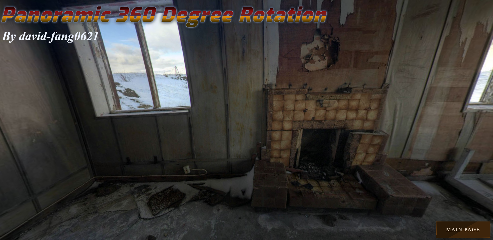
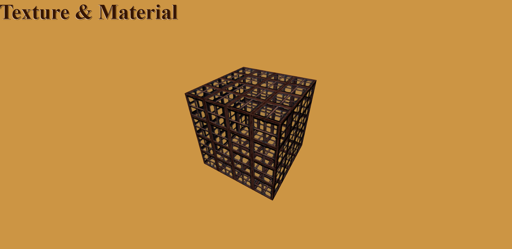
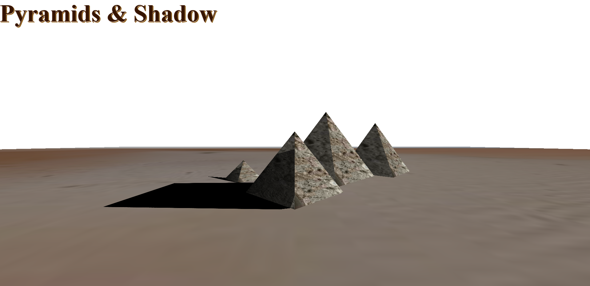

## Code is like humor. When you have to explain it, it’s bad

### ABOUT ME
Passionate and skilled Software Enginner offering 7 years of relevant experience and a proven track record of success in achieving extraordinary results. With strong attention to detail and accuracy and the important ability to function well in a team setting, Always growing up with a forward-moving company.

- 🚀 I respect and understand your needs, my goal is to give you 100%-satisfaction.
- 👍 Always, I will achieve effectiveness, high quality, and fastest delivery, maintenance.
- 👨‍🎓 I strive to make today better than yesterday, I value self-development and continuous improvement.
- 😃 Have a Project in your Mind?
- ✨ I will implement your great ideas to be live perfectly.
- 📫 Contact me **[Join on Skype](https://join.skype.com/invite/vvzkvgxuRb21)** and **<a href="mailto:fanghuateng0621@gmail.com">Send Mail</a>** if you need my help.

### MY TECH STACK
#### FRONTEND


#### BACKEND


### MY PRODUCTS (click image for more details)
| <a target="_blank" href="https://david-fang0621.github.io/3d-panoramic-360-degree-rotation/"></a> | <a target="_blank" href="https://david-fang0621.github.io/3d-panoramic-360-degree-rotation/"></a> |
| ----- | ----- |
| <a target="_blank" href="https://david-fang0621.github.io/3d-panoramic-360-degree-rotation/"></a> | <a target="_blank" href="https://david-fang0621.github.io/3d-panoramic-360-degree-rotation/"></a> |

#### :bar_chart: [Monthly coding time](https://github.com/muety/wakapi)

<!--START_SECTION:waka-->

```text
PHP            13 hrs 14 mins  🟩🟩🟩🟩🟩🟩🟩🟨⬜⬜⬜⬜⬜⬜⬜⬜⬜⬜⬜⬜⬜⬜⬜⬜⬜   30.26 %
JavaScript     11 hrs 35 mins  🟩🟩🟩🟩🟩🟩🟨⬜⬜⬜⬜⬜⬜⬜⬜⬜⬜⬜⬜⬜⬜⬜⬜⬜⬜   26.48 %
Python         4 hrs 9 mins    🟩🟩🟨⬜⬜⬜⬜⬜⬜⬜⬜⬜⬜⬜⬜⬜⬜⬜⬜⬜⬜⬜⬜⬜⬜   09.50 %
Shell          2 hrs 41 mins   🟩🟨⬜⬜⬜⬜⬜⬜⬜⬜⬜⬜⬜⬜⬜⬜⬜⬜⬜⬜⬜⬜⬜⬜⬜   06.14 %
unknown        1 hrs 50 mins   🟩⬜⬜⬜⬜⬜⬜⬜⬜⬜⬜⬜⬜⬜⬜⬜⬜⬜⬜⬜⬜⬜⬜⬜⬜   04.18 %
CSS            1 hrs 42 mins   🟩⬜⬜⬜⬜⬜⬜⬜⬜⬜⬜⬜⬜⬜⬜⬜⬜⬜⬜⬜⬜⬜⬜⬜⬜   03.90 %
```

<!--END_SECTION:waka-->

---
